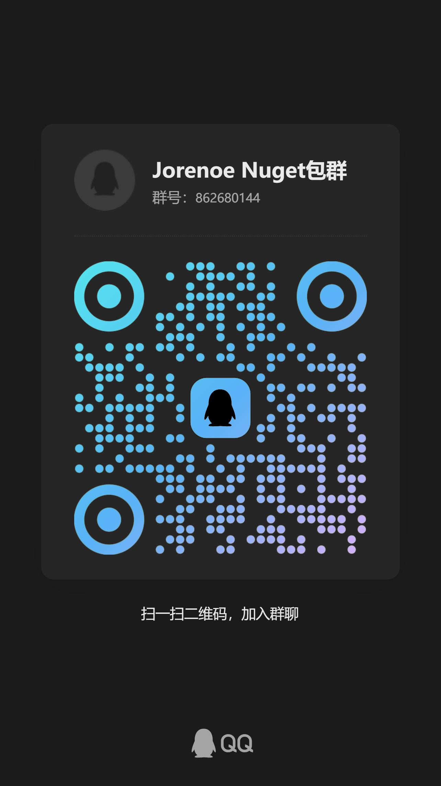

# Welcome

👋 Hi, I'm **JoreNoe**!\
🚀 I am passionate about software development and always eager to learn new technologies and improve my skills.

🔗 [**Github**](https://github.com/JoraNoe):                      📦 **Nuget**: [JoreNoe](https://www.nuget.org/packages/JoreNoe#readme-body-tab)                         🌐 **个人网站**: [jorenoe.top](https://jorenoe.top)           &#x20;

<figure><figcaption></figcaption></figure>

<figure><figcaption></figcaption></figure>

## 📚 Jorenoe 文档

### 🚀 概览

**Jorenoe** 是一款高效的 Net 封装快速开发工具包，支持多种数据库及高性能数据访问方式。

#### 📌 支持特性

* **数据库支持**：MySQL、SQL Server
* **ORM 框架**：Dapper、Entity Framework Core
* **消息队列**：RabbitMQ 集成
* **缓存**：Redis 高效数据存储 等

### 选择阅读Jorenoe文档

***

<table data-view="cards"><thead><tr><th></th><th></th><th data-hidden data-card-cover data-type="files"></th><th data-hidden></th><th data-hidden data-card-target data-type="content-ref"></th></tr></thead><tbody><tr><td>新版 Jorenoe 文档</td><td>详细文档说明</td><td><a href=".gitbook/assets/jorenoe.ico">jorenoe.ico</a></td><td></td><td><a href="getting-started/xin-ban-jorenoe-wen-dang.md">xin-ban-jorenoe-wen-dang.md</a></td></tr><tr><td>旧版 Jorenoe 文档</td><td>详细文档说明</td><td><a href=".gitbook/assets/jorenoe.ico">jorenoe.ico</a></td><td></td><td><a href="getting-started/quickstart.md">quickstart.md</a></td></tr></tbody></table>

***

### 📞 联系方式

📧 **邮箱**：jorenoe@163.com\
💬 **QQ**：2270312758\
💬QQ群：862680144

📌 **持续更新中...** 欢迎提交建议 & 反馈 & 技术讨论🚀

<figure><figcaption></figcaption></figure>
